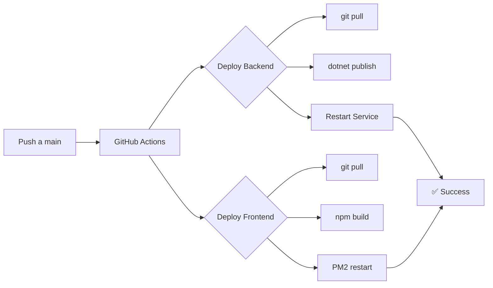

# 🚀 GitHub Actions - Configuración de CI/CD

Este directorio contiene los workflows de GitHub Actions para automatización de despliegues y pruebas.

## 📁 Archivos

### `workflows/deploy.yml`
Workflow principal de despliegue automático que se ejecuta en cada push a `main`.

**Funcionalidades**:
- ✅ Despliegue automático del backend (.NET)
- ✅ Despliegue automático del frontend (Next.js)
- ✅ Actualización de código vía SSH
- ✅ Instalación de dependencias
- ✅ Compilación de proyectos
- ✅ Reinicio de servicios con PM2
- ✅ Notificaciones de estado

### `DEPLOYMENT.md`
Guía completa de configuración del servidor y secretos de GitHub.

### `TROUBLESHOOTING.md`
Solución de problemas comunes del workflow con ejemplos y fixes detallados.

### `QUICK_FIX.md`
Guía rápida para solucionar el error más común (SSH_HOST vacío).

## 🔐 Secretos Requeridos

Configura estos secretos en: `Settings > Secrets and variables > Actions`

| Secreto | Descripción | Ejemplo |
|---------|-------------|---------|
| `SSH_HOST` | IP o dominio del servidor | `192.168.1.100` |
| `SSH_USER` | Usuario SSH | `deployer` |
| `SSH_KEY` | Clave privada SSH completa | `-----BEGIN OPENSSH...` |
| `APP_PATH_BACKEND` | Ruta del backend en servidor | `/var/www/TestMillion/Back` |
| `APP_PATH_FRONTEND` | Ruta del frontend en servidor | `/var/www/TestMillion/Front` |
| `PM2_APP_NAME_FRONTEND` | Nombre de app en PM2 | `real-estate-frontend` |
| `FRONTEND_PORT` | Puerto del frontend **(opcional)** | `3000` |
| `NEXT_PUBLIC_API_URL` | URL del API backend | `http://192.168.1.100:5206/api` |

## 🚀 Inicio Rápido

### 1. Generar Claves SSH
```bash
ssh-keygen -t ed25519 -C "github-actions" -f ~/.ssh/github_deploy
ssh-copy-id -i ~/.ssh/github_deploy.pub user@servidor
```

### 2. Configurar Secretos en GitHub
- Ve a tu repositorio > Settings > Secrets and variables > Actions
- Agrega cada secreto de la tabla anterior

### 3. Preparar el Servidor
```bash
# Instalar dependencias
sudo apt update
sudo apt install git nodejs npm -y
sudo npm install -g pm2

# Clonar repositorio
mkdir -p ~/apps && cd ~/apps
git clone https://github.com/tu-usuario/TestMillion.git
```

### 4. Push a Main
```bash
git add .
git commit -m "Deploy: Initial setup"
git push origin main
```

### 5. Verificar Despliegue
Ve a: `https://github.com/tu-usuario/TestMillion/actions`

## 📖 Documentación Completa

Para instrucciones detalladas, consulta [DEPLOYMENT.md](./DEPLOYMENT.md)

## 🔄 Flujo de Trabajo



## 🆘 Soporte

Si tienes problemas:

### Error SSH_HOST vacío (más común)
📖 [Solución Rápida](./QUICK_FIX.md) - Arreglo en 3 pasos (2 minutos)

### Otros Errores
1. 🐛 [Guía Completa de Troubleshooting](./TROUBLESHOOTING.md)
2. 📖 [Guía de Despliegue](./DEPLOYMENT.md#solución-de-problemas)
3. ✅ [Checklist de Verificación](./DEPLOYMENT_CHECKLIST.md)
4. Verifica los logs en la pestaña Actions de GitHub
5. Conéctate al servidor y revisa logs con `pm2 logs`

## 📝 Notas

- El workflow se ejecuta automáticamente en cada push a `main`
- Se pueden ejecutar manualmente desde la pestaña Actions
- Los despliegues del backend y frontend son independientes
- Si un despliegue falla, el otro puede continuar

---

**Proyecto**: Real Estate API  
**Stack**: .NET 9 + Next.js + MongoDB  
**Última actualización**: Noviembre 2025

